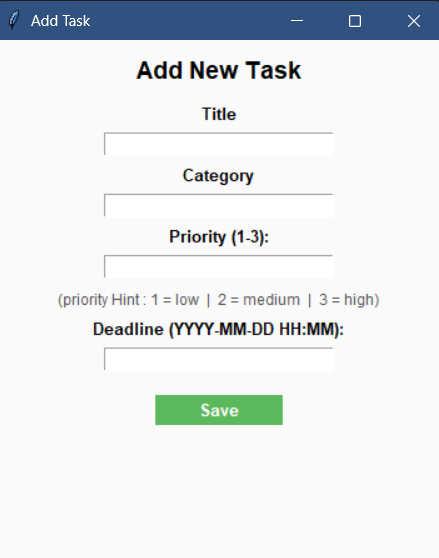
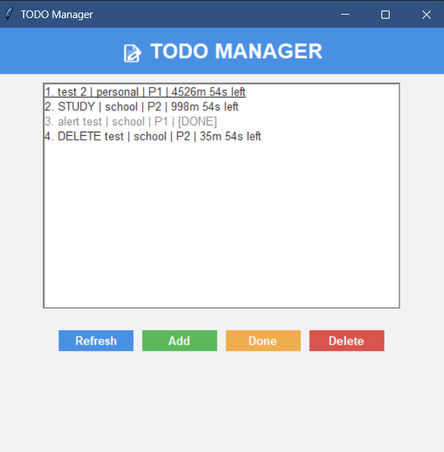
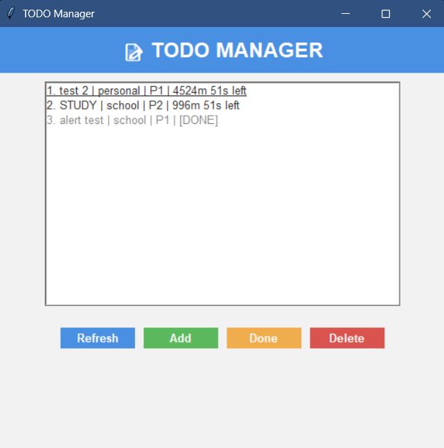
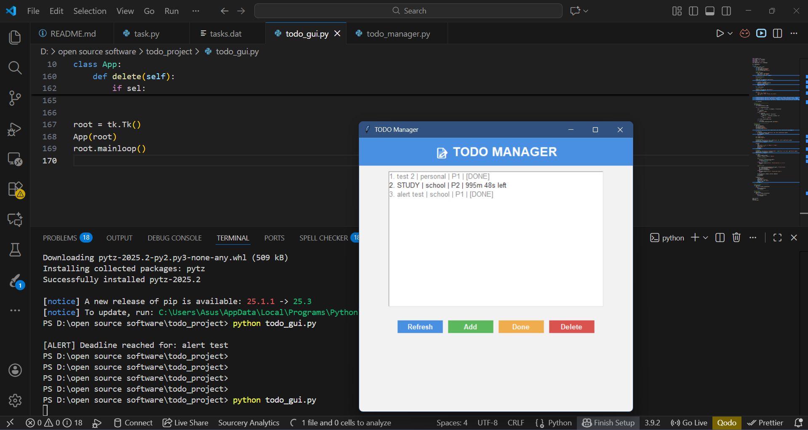

# TODO Manager (Python GUI Application)

## Overview

This project is a **GUI-based Task Management Application** developed in Python using `Tkinter`.  
It allows users to add, view, complete, delete, and track tasks with deadlines and priority levels.  
Each task can trigger an automatic alert when the deadline is reached.  
The program stores all tasks locally using Python’s `pickle` module.

This project was developed for the **Open Source Programming** course.

---

## Key Features

### Add New Tasks

Users can create tasks with:

- Title
- Category
- Priority (1 = low, 2 = medium, 3 = high)
- Deadline (KST — YYYY-MM-DD HH:MM)

**Screenshot:**  


---

### View Tasks (Main GUI)

Tasks are displayed with:

- Title
- Category
- Priority
- Remaining Time
- Expired status

**Screenshot:**  


---

### ✔ Mark Tasks as Completed

Selecting a task and clicking **Done** marks it as completed.

**Screenshot:**  


---

### ✔ Delete Tasks

Users can delete any selected task using the Delete button.

**Screenshot:**  


---

### ✔ Automatic Deadline Alerts (Thread-Based)

A background thread waits until each task deadline.  
When the time is up, the console prints:

```
[ALERT] Deadline reached for: <task title>
```

**Screenshot:**  


---

## 🧩 Project Structure

```
todo_project/
├── todo_gui.py
├── todo_manager.py
├── task.py
├── tasks.dat          # auto-created, not uploaded to GitHub
└── README.md
```

**Screenshot:**  


---

## 🛠 Requirements

Python **3.8+**

Modules used:

- tkinter
- time
- datetime
- threading
- pickle
- pytz

---

## ▶️ How to Run (VSCode / Terminal)

### 1. Open the project folder

```
cd "D:\open source software\todo_project"
```

### 2. Run the program

```
python todo_gui.py
```

**Screenshot:**  


---

## 📝 How to Use the Application

### 1. Create a New Task

Click **Add**, fill the fields, and press Save.

**Screenshots:**  
  


---

### 2. Mark a Task as Done

Select the task → click **Done**.

**Screenshot:**  


---

### 3. Delete a Task

Select → click **Delete**.

**Screenshot:**  


---

### 4. Deadline Alert Test

If deadline is reached, console prints an alert.

**Screenshot:**  


---

## 📦 Data Persistence

All tasks are saved in `tasks.dat` using **pickle**.  
When reopening the program, saved tasks are loaded automatically.

**Screenshot:**  


---

## 🧪 Manual Testing Checklist

| Test             | Expected               |
| ---------------- | ---------------------- |
| Add Task         | Task appears in list   |
| Invalid Deadline | Error popup            |
| Mark Done        | Task marked completed  |
| Delete Task      | Removed from list      |
| Restart Program  | Tasks still exist      |
| Deadline Reached | Terminal alert printed |

(Use the screenshots above for documentation.)

---

## 📤 Submission Requirements

### ✔ Include:

- todo_gui.py
- todo_manager.py
- task.py
- README.md

### ❌ Do NOT include:

- tasks.dat
- \_\_pycache\_\_/

Add this to `.gitignore`:

```
tasks.dat
__pycache__/
*.pyc
```

---
---

## 🤖 AI Assistance & Acknowledgements

The core architecture and initial logic of this project are based on the author's previous work (a command-line task manager). During the development of the GUI and background services, an AI tool (specifically [**ChatGPT**]) was utilized for optimizing and ensuring the robustness of specific advanced components.

Key areas where AI assistance was leveraged include:

1.  **Timezone and Timestamp Conversion:** Consulting the AI tool to confirm the correct implementation of `pytz` and `datetime` functions for accurately converting user-input time (KST) into a valid, localized Unix timestamp, ensuring reliable deadline tracking.
2.  **Background Reminder Threading:** Ensuring the multi-threaded implementation (`threading.Thread`) used to manage deadline alerts was configured correctly (e.g., using `daemon=True` and proper time calculation) to run in the background without freezing the main Tkinter GUI.
3.  **Thread Safety and Locking:** Validating the correct use of `threading.Lock` within the `TodoManager` to protect the shared data file (`tasks.dat`) from corruption during simultaneous read/write operations by different threads.

---
## 🔍 Optional Future Improvements

- Edit tasks
- Sort tasks (by date/priority/category)
- Add search bar in GUI
- Use JSON or SQLite instead of pickle
- Add system notifications

---

## 🏁 Conclusion

This project demonstrates:

- GUI design with Tkinter
- Multithreading for alerts
- Local file persistence
- A clean, functional interface
- Manual testing and documentation

The application is simple but fully functional, and ideal for an academic open-source course.
